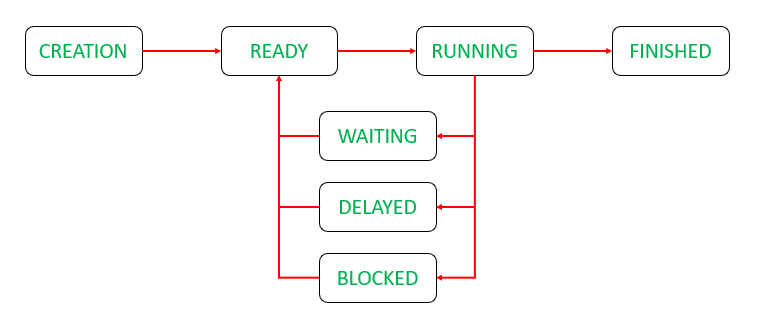

# Лабораторная работа №1

> На языке С/С++ стандартными средствами используемой системы программирования написать параллельное приложение, создающее 3 дополнительных вычислительных потока – 2 «писателя» и 1 «читатель», выполняющих обмен информацией через буфер длины 10. Для простоты под пересылаемой информацией можно понимать целые числа – 1й и 2й потоки их генерируют и записывают в буфер каждый со своей скоростью, 3й поток читает и выводит на экран.

* Продемонстрировать корректную работу обмена при различных скоростях работы потоков.

* Ответить на следующие вопросы:

    1) Привести определения процесса и потока

       > **Процесс** характеризует некоторую совокупность набора исполняющихся команд, ассоциированных с ним ресурсов
       (выделенная для исполнения память или адресное пространство, стеки, используемые файлы и устройства ввода-вывода и т. д.) и текущего момента его выполнения (значения регистров, программного счетчика, состояние стека и значения переменных), находящуюся под управлением операционной системы.

       > Процесс может порождать несколько **потоков**, которые будут выполняться одновременно и параллельно. Важно отметить, что все потоки одного процесса будут исполнять отдельные части кода одной программы, деля между собой общие ресурсы, выделенные процессу.

    2) Сколько потоков и в каком порядке создается в ходе работы приложения?

       > Создается 3 потока, запускаются они в порядке, определяемом планировщиком ОС.

    3) Чем определяется порядок выполнения потоков? Какая дисциплина используется?

       > Порядок выполнения потоков определяется используемым алгоритмом планирования в ОС.

    4) Описать все смены состояний потоков в ходе работы приложения

       

    5) Какова дисциплина обслуживания буфера и почему выбрана именно она?

       > Через mutex, чтобы исключить возможность race condition.

    6) Какие операции доступа к буферу должны синхронизироваться и почему?

       > Любые неидемпотентные операции (изменение его состояния), чтобы исключить race condition.

    7) Какой механизм выбран для реализации синхронизации и почему? Чем он отличается от классического семафора
       Дейкстры?

       > Для изменения буффера выбран mutex, ведь изменить данные в конкретный момент времени может только один поток. Для поддержания размера буфера в BUFFER_SIZE используются N=10-мерные семафоры.
       